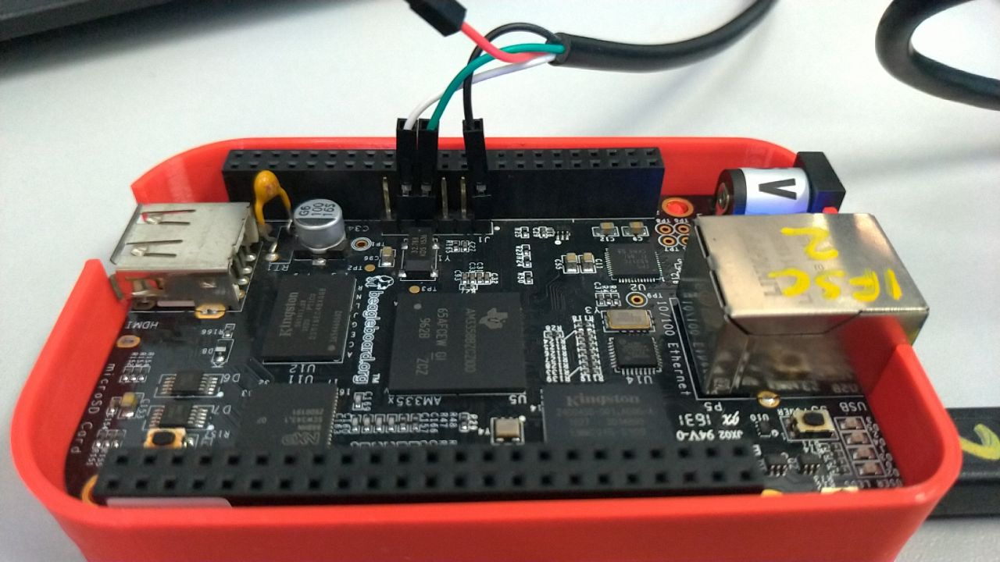

# Lab 01

O objetivo deste laboratório é prepararmos o seu computador para a realização das práticas que realizaremos ao longo do curso.

Recomendamos o uso de uma distribuição atual de Linux para o desenvolvimento das atividades práticas, o que pode ser realizado através de uma instalação nativa em seu computador, ou através do uso de um sistema de virtualização como VirtualBox ou VMWare. Também é possível utilizar o Windows Subsystem for Linux (WSL). Algumas instruções para configuração do WSL no Windows são fornecidas nesta [página](wsl/README.md).

## Passos Iniciais

Inicialmente, vamos garantir que o nosso sistema Ubuntu esteja atualizado, executando os seguintes comandos:

```
sudo apt update
sudo apt dist-upgrade
```

Adicionalmente, recomendamos a instalação das seguintes ferramentas adicionais:

```
sudo apt install git vim nano 
```

Instalar as seguintes dependências para uso do Buildroot

```
sudo apt install sed make binutils gcc g++ bash patch gzip bzip2 perl tar cpio python unzip rsync wget libncurses-dev libncursesw5 libpython2.7 bc 
```

Clonar o repositório com o comando

```
git clone --recurse-submodules https://github.com/profmarcondes/emb22109.git
```

O último comando irá fazer o clone deste repositório, que contém além destes laboratórios, outras pastas que serão utilizadas em laboratórios futuros, além do próprio repositório do Buildroot já configurado para a versão que iremos utilizar durante o curso.

Agora entraremos na pasta buildroot, dentro do repositório para iniciar a configuração do mesmo. Utilize o comando abaixo para isto:

```
cd lxe22109/buildroot
```

## Configurando o Buildroot

Se você olhar no diretório configs/, verá que existe um arquivo chamado beaglebone_defconfig, que é um arquivo de configuração Buildroot pronto para uso para construir um sistema para a plataforma BeagleBone Black. No entanto, como queremos aprender sobre o Buildroot, iniciaremos nossa própria configuração do princípio!

Inicie o utilitário de configuração Buildroot:

```
make menuconfig
```

Realize as seguintes configurações na ferramenta:

#### Target Options

Neste menu iremos configurar a arquitetura alvo de nosso sistema embarcado. A plataforma Beagle Bone Black é baseada na arquitetura ARM, e de acordo com a documentação disponível em https://beagleboard.org/BLACK, a mesma utiliza o SoC da Texas Instruments AM335x, que é baseado em um ARM Cortex-A8. Desta forma, realize as seguintes configurações:

  - Selecione ARM (little endian) como  target architecture
  - Selecione cortex-A8 como Target Architecture Variant

#### Build options

Por hora não necessitamos modificar nenhum configuração do menu Build Options. De qualquer forma, aproveita para visitar esse menu e observar as opções de configuração que temos disponível. A ferramenta KConfig possui uma opção de ajuda para descrever mais informações sobre cada item de configuração. 

#### Toolchain
  - Configure External toolchain como Toolchain type
  - Selecione Arm ARM 2021.07 como Toolchain
 
#### System
 - Configure a senha de root (Root password). Utilize a senha padrão tmp1223
 
#### Linux Kernel
 - Habilitar a opção de Linux Kernel 
 - Kernel version -> selecionar "Custom version" e configurar a versão 5.15.35
 - Configurar Defconfig name com "omap2plus"
 - Kernel binary format, utilizar zImage
 - Habilite a opção "Build a Device Tree Blob (DTB)" 
 - Configurar In-tree Device Tree Source file names com "am335x-boneblack"
 - Habilitar opção "Needs host OpenSSL"
 
#### Target Packages

Por hora não iremos habilitar nenhum outro pacote nesta configuração inicial

#### Filesystem

Por hora não iremos modificar a opção padrão (tar the root filesystem)

#### Bootloaders

  - Habilitar o U-boot
  - Confirmar o BUild system como Kconfig
  - U-Boot version -> selecionar "Custom version" e configurar a versão 2022.04
  - Configurar Board defconfig como am335x_evm
  - Marcar U-Boot needs OpenSSL
  - No menu U-Boot binary format
    - Desmarcar "u-boot.bin"
    - Marcar "u-boot.img"
  - Habilitar Install U-Boot SPL binary image 
  - Configurar U-Boot SPL binary image name com "MLO"
  - Configurar Custom make options com "DEVICE_TREE=am335x-boneblack"

#### Finalizando a configuração e gerando o Linux Embarcado

Pronto, agora sai de todos os menus da ferramenta Kconfig, não se esquecendo de confirmar a gravação das configurações no sistema, respondeno Yes quando perguntado.

Você irá voltar a linha de comando, dentro da pasta do Buildroot. Para iniciar a geração do sistema, basta executar o comando ```make```, mas iremos modificar um pouco o comando para criar também um arquivo de log de toda a geração do sistema, desta forma, execute o comando:

```
make 2>&1 | tee build.log
```

Pronto ! Agora esse processo deve demorar um pouquinho devido a necessidade de baixar todos os pacotes dos componentes necessários, além da compilação do kernel também ser um pouco demorada.

## Preparando a Beagle Bone (em tradução - revisar)

O BeagleBone Black é alimentado pelo cabo USB-A para mini-USB, conectado ao conector mini-USB identificado como P4 na parte traseira da placa.

O conector serial Beaglebone é exportado nos 6 pinos macho próximos a um dos cabeçalhos de 48 pinos. Usando seu adaptador USB para Serial especial fornecido por seu instrutor, conecte o fio terra (preto) ao pino mais próximo ao conector da fonte de alimentação (vamos chamá-lo de pino 1) e os fios TX (verde) e RX (branco) ao pinos 4 (placa RX) e 5 (placa TX). Você sempre deve se certificar de conectar o pino TX do cabo ao pino RX da placa e vice-versa, qualquer que seja a placa e os cabos que você usa.

<p align="center">

Depois que o conector USB para serial estiver conectado, uma nova porta serial deve aparecer: /dev/ttyUSB0.

Você também pode ver este dispositivo aparecer olhando a saída do comando  `dmesg`.

Para se comunicar com a placa através da porta serial, instale um programa de comunicação serial, como o picocom:

```
sudo apt install picocom
```

Se você executar ls -l /dev/ttyUSB0, também poderá ver que apenas o root e os usuários pertencentes ao grupo dialout têm acesso de leitura e gravação a esse arquivo. Portanto, você precisa adicionar seu usuário ao grupo de discagem:

```
sudo adduser $USER dialout
```

*** adicionar observação sobre o WSL ***

Importante: para que a mudança de grupo seja efetiva, no Ubuntu 18.04, você deve reiniciar completamente o sistema <!--2 Conforme explicado em https://askubuntu.com/questions/1045993/after-adding-a-group-logoutlogin-is-notenough-in-18-04/.
-->. Uma solução alternativa é executar newgrp dialout, mas não é global. Você tem que executá-lo em cada terminal.

Agora, você pode executar `picocom -b 115200 /dev/ttyUSB0`, para iniciar a comunicação serial em /dev/ttyUSB0, com uma taxa de transmissão de 115200. Se desejar sair do picocom, pressione [Ctrl][a] seguido de [Ctrl][x].

Não deve haver nada na linha serial até agora, pois a placa ainda não foi energizada.


## Preparando o cartão SD

Nosso cartão SD precisa ser dividido em duas partições:

  - Uma primeira partição para o bootloader. Ele precisa atender aos requisitos do AM335x SoC para que possa encontrar o bootloader nesta partição. Deve ser uma partição FAT32. Vamos armazenar o bootloader (MLO e u-boot.img), a imagem do kernel (zImage) e a Árvore de Dispositivos (am335x-boneblack.dtb).
  - Uma segunda partição para o sistema de arquivos raiz. Ele pode usar qualquer tipo de sistema de arquivos que você quiser, mas para o nosso sistema, usaremos o ext4.

Primeiro, vamos identificar sob qual nome seu cartão SD é identificado em seu sistema: observe a saída de cat /proc/partitions e encontre seu cartão SD. Em geral, se você usar o leitor de cartão SD interno de um laptop, será mmcblk0, enquanto se usar um leitor de cartão SD USB externo, será sdX (ou seja, sdb, sdc, etc.). **Cuidado: /dev/sda geralmente é o disco rígido da sua máquina!**

Se o seu cartão SD for /dev/mmcblk0, as partições dentro do cartão SD serão nomeadas /dev/mmcblk0p1, /dev/mmcblk0p2, etc. Se o seu cartão SD for /dev/sdc, as partições internas serão nomeadas /dev/ sdc1, /dev/sdc2, etc.

Para formatar seu cartão SD, siga os seguintes passos:

1. Desmonte todas as partições do seu cartão SD (geralmente são montadas automaticamente pelo Ubuntu)

2. Apague o início do cartão SD para garantir que as partições existentes não sejam detectadas por engano:

   ```
   sudo dd if=/dev/zero of=/dev/mmcblk0 bs=1M count=16.
   ```
   
   Use sdc ou sdb em vez de mmcblk0, se necessário.

3. Crie as duas partições.
    - Inicie a ferramenta cfdisk para isso:
    
      ```
      sudo cfdisk /dev/mmcblk0
      ```
    
    - Escolha o tipo de tabela de partição DOS
    - Crie uma primeira partição pequena (128 MB), primária, do tipo e (W95 FAT16) e marque-a como inicializável
    - Crie uma segunda partição, também primária, com o restante do espaço disponível, do tipo 83 (Linux).
    - Sair do cfdisk


4. Formate a primeira partição como um sistema de arquivos FAT32:

   ```
   sudo mkfs.vfat -F 32 -n boot /dev/mmcblk0p1.
   ```

   Use sdc1 ou sdb1 em vez de mmcblk0p1, se necessário.

5. Formate a segunda partição como um sistema de arquivos ext4:

   ```
   sudo mkfs.ext4 -L rootfs -E nodiscard /dev/mmcblk0p2.
   ```
   
   Use sdc2 ou sdb2 em vez de mmcblk0p2, se necessário.
  
      - -L atribui um nome de volume à partição
      - -E nodiscard desativa o descarte de blocos inválidos. Embora essa seja uma opção útil para cartões com blocos defeituosos, pular essa etapa economiza longos minutos em cartões SD.

Remova o cartão SD e insira-o novamente, as duas partições devem ser montadas automaticamente, em /media/$USER/boot e /media/$USER/rootfs.

Agora tudo deve estar pronto. Esperançosamente, nesse momento, a compilação do Buildroot deve ter sido concluída. Se não, espere mais um pouco.

## Gravando o sistema

Depois que o Buildroot terminar de construir o sistema, é hora de colocá-lo no cartão SD:

  - Copie os arquivos MLO, u-boot.img, zImage e am335x-boneblack.dtb de output/images/ para a partição de inicialização do cartão SD.
    ```
    cp output/images/{MLO,u-boot.img,zImage,am335x-boneblack.dtb} /media/$USER/boot/
    ```
  - Extraia o arquivo rootfs.tar para a partição rootfs do cartão SD, usando:
    ```
    sudo tar -C /media/$USER/rootfs/ -xf output/images/rootfs.tar
    ```

- Crie um arquivo chamado `uEnv.txt` na partição de inicialização. Este arquivo deve conter as seguintes linhas:

```
bootpart=0:1
devtype=mmc
bootdir=
bootfile=zImage
bootpartition=mmcblk0p2
console=ttyS0,115200n8
loadaddr=0x82000000
fdtaddr=0x88000000
set_mmc1=if test $board_name = A33515BB; then setenv bootpartition mmcblk1p2; fi
set_bootargs=setenv bootargs console=${console} root=/dev/${bootpartition} rw rootfstype=ext4 rootwait
uenvcmd=run set_mmc1; run set_bootargs;run loadimage;run loadfdt;printenv bootargs;bootz ${loadaddr} - ${fdtaddr}
```
Estas linhas ensinam o bootloader U-Boot como carregar a imagem do kernel do Linux e o
Device Tree, antes de inicializar o kernel. <!--Ele usa um mecanismo U-Boot padrão chamado distro boot command, consulte https://source.denx.de/u-boot/u-boot/-/raw/master/doc/README. distro para mais detalhes.-->

Desmonte as duas partições do cartão SD e ejete o cartão SD.

## Boot do sistema

Insira o cartão SD no BeagleBone Black. Pressione o botão S2 (localizado perto do conector host USB) e conecte o cabo de alimentação USB enquanto segura S2. Pressionar S2 força o BeagleBoneBlack a inicializar a partir do cartão SD em vez do eMMC interno.

Você deve ver o seu sistema inicializando. Certifique-se de que o U-Boot SPL e a versão do U-Boot e as datas de construção correspondem à data atual. Faça a mesma verificação para o kernel do Linux.

Faça login como root no BeagleBone Black e explore o sistema. Execute ps para ver quais processos estão em execução e observe o que o Buildroot gerou em /bin, /lib, /usr e /etc.

Nota: se o seu sistema não inicializar conforme o esperado, certifique-se de redefinir o ambiente U-Boot executando os seguintes comandos U-Boot:

```
env padrão -f -a
saveenv
```

e redefinir. Isso é necessário porque o U-Boot carregado do cartão SD ainda carrega o ambiente U-Boot do eMMC. Peça esclarecimentos adicionais ao seu instrutor, se necessário.

## Explore o log de construção do sistema

De volta à sua máquina de compilação, já que redirecionamos a saída da compilação para um arquivo chamado build.log, agora podemos dar uma olhada nele para ver o que aconteceu. Como a compilação Buildroot é bastante detalhada, Buildroot imprime antes de cada etapa importante uma mensagem prefixada pelo sinal >>>. Portanto, para ter uma ideia geral do que a compilação fez, você pode executar:

```
grep ">>>" build.log
```

Você vê os diferentes pacotes entre baixados, extraídos, corrigidos, configurados, construídos e
instalado.

Sinta-se à vontade para explorar o diretório output/ também.

