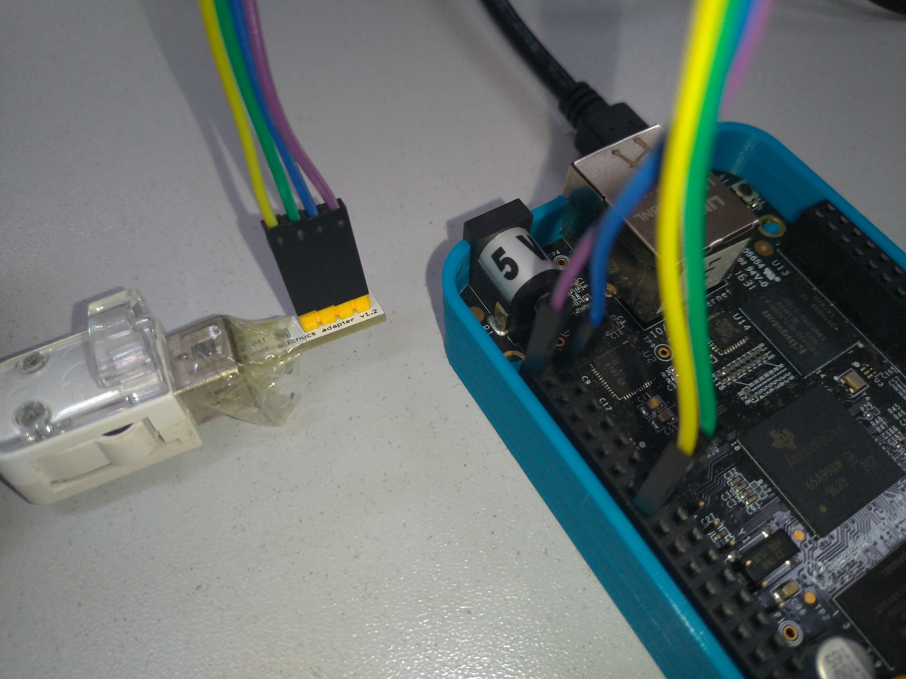

# Lab 02

Objetivos:
   - Explorar a saída de compilação
   - Personalizar o sistema de arquivos raiz usando uma sobreposição do rootfs
   - Personalizar a configuração do kernel do Linux
   - Usar um script pós-compilação
   - Personalizar o kernel com patches e
   - Adicionar mais pacotes
   - Use arquivos defconfig e construção fora da árvore
  
## Explorar a saída de compilação

Agora que discutimos durante as palestras a organização da árvore de saída Buildroot, dedique algum tempo para olhar dentro da saída/ para os diferentes artefatos de construção. E especialmente:

   - Identifique onde o cross-compiler foi instalado.
   - Identificar onde o código-fonte dos diferentes componentes foi extraído e quais pacotes foram construídos.
   - Identifique onde o sistema de arquivos raiz de destino foi criado e leia o arquivo `THIS_IS_NOT_YOUR_ROOT_FILESYSTEM`.
   - Veja para onde o link simbólico de 'staging' está apontando.
  
## Utilização da sobreposição do rootfs para configurar a rede

Usaremos Ethernet sobre USB para fornecer conectividade de rede entre nosso sistema embarcado e o PC de desenvolvimento. Para conseguir isso, precisaremos:

1. Adicionar um script de inicialização para configurar a rede por USB
2. Adicionar um arquivo de configuração que configure a interface de rede com o IP apropriado
endereço
3. Instalar um servidor DHCP para fornecer configuração automática de rede no PC de desenvolvimento.

### Script de inicialização para configuração de rede USB

Existem diferentes mecanismos para configurar o gadget USB com o Linux: usaremos a interface gadget configfs, que permite a partir do espaço do usuário criar dispositivos USB fornecendo um conjunto arbitrário de funcionalidades[^usb_gadget].
[^usb_gadget]: Veja https://elinux.org/images/e/ef/USB_Gadget_Configfs_API_0.pdf para mais detalhes

Como a configuração desse dispositivo USB não é trivial, fornecemos um script de shell pronto para uso que adicionaremos aos scripts de inicialização do sistema Buildroot. O script é chamado `S30usbgadget` e está disponível neste repositório em [/labs/lab02/files/S30usbgadget](./files/S30usbgadget).

Poderíamos copiar este script diretamente para o nosso cartão SD, mas isso significaria que na próxima atualização do cartão SD com o sistema de arquivos raiz produzido pelo Buildroot, perderíamos essas alterações.

Para automatizar a adição deste script ao sistema de arquivos raiz como parte da compilação Buildroot, usaremos o mecanismo **rootfs overlay**. Como essa *sobreposição* é específica para nosso projeto, criaremos um diretório personalizado para nosso projeto dentro dos fontes do Buildroot: `board/ifsc/beagleboneblack/`.

Dentro deste diretório, crie um diretório `rootfs-overlay`, e no menuconfig, especifique `board/ifsc/beagleboneblack/rootfs-overlay` como rootfs overlay (opção BR2_ROOTFS_OVERLAY).

Copie o script `S30usbgadget` para o seu overlay para que ele fique localizado em `board/ifsc/beagleboneblack/rootfs-overlay/etc/init.d/S30usbgadget`. No momento da inicialização, o sistema init padrão usado pelo Buildroot executará todos os scripts denominados `SXX*` em `/etc/init.d`.

Além disso, copie o script `S99led` para sua sobreposição do rootfs para que fique localizado em `board/ifsc/beagleboneblack/rootfs-overlay/etc/init.d/S99led`. Este script acenderá um LED no Beagle Bone para sinalizar que o processo de inicialização foi concluído.

### Configuração do endereço IP

Por padrão, o Buildroot usa o programa ifup do BusyBox, que lê o arquivo `/etc/network/interfaces` para configurar as interfaces de rede. Então, em `board/ifsc/beagleboneblack/rootfs-overlay`, crie um arquivo chamado `etc/network/interfaces` com o seguinte conteúdo:

```
auto lo
iface lo inet loopback

auto usb0
iface usb0 inet static
  address 192.168.0.1
  netmask 255.255.255.0
```

Em seguida, reconstrua seu sistema executando `make`. Aqui também não precisamos fazer uma reconstrução completa, pois as sobreposições rootfs são aplicadas no final de cada compilação. Você pode verificar em `output/target/etc/init.d/` e `output/target/etc/network/` se o script init e os arquivos de configuração de rede foram copiados corretamente.

Atualize novamente o sistema de arquivos raiz no cartão SD e inicialize seu BeagleBone Black. Agora ele deve ter um endereço IP configurado para usb0 por padrão.

## Configure a rede em seu host

Iremos realizar a configuração da rede no computador host através do DHCP, para tanto, iremos instalar na BeagleBone um servidor de DHCP.

### Servidor DHCP para configuração automática

Execute `make menuconfig` e habilite o pacote dhcp (ISC). Antes de selecionar o dhcp (ISC), precisamos habilitar o Buildroot para mostrar os pacotes que já são fornecidos pelo Busybox.

Você pode usar a capacidade de pesquisa do menuconfig digitando `/`, digite `SHOW_OTHERS`. Ele fornecerá uma lista de resultados e cada resultado está associado a um número entre parênteses, como (1). Em seguida, basta pressionar 1 e o menuconfig pulará para a opção correta. Selecione a opção `Mostrar pacotes que também são fornecidos pelo busybox`. Agora use o recurso de pesquisa novamente para instalar o pacote `dhcp (ISC)`. Selecione também a opção `dhcp server`.

Agora vamos incluir a configuração do servidor DHCP em seu rootfs. Então, em `board/ifsc/beagleboneblack/rootfs-overlay`, crie um arquivo chamado `etc/dhcp/dhcpd.conf` com o seguinte conteúdo:

```
ddns-update-style none;
default-lease-time 600;

max-lease-time 7200;

authoritative;

log-facility local7;

subnet 192.168.0.0 netmask 255.255.255.0 {
  range 192.168.0.10 192.168.0.50;
  option broadcast-address 192.168.0.255;
}
```

Pronto, o servidor DHCP está habilitado para construção no Buildroot e configurado para fornecer um ip para o seu computador host na faixa 192.168.0.10 a 192.168.0.50. 

## Adicionar dropbear como um servidor SSH

Agora, vamos adicionar o cliente/servidor dropbear SSH. O servidor será executado no BeagleBone Black, o que nos permitirá conectar pela rede ao BeagleBone Black.

Execute `make menuconfig` e habilite o pacote dropbear. Use o recurso de pesquisa do menuconfig digitando /, digite DROPBEAR. Ele fornecerá uma lista de resultados e cada resultado está associado a um número entre parênteses, como (1). Em seguida, basta pressionar 1 e o menuconfig pulará para a opção correta.

Depois de sair do menuconfig, reinicie a compilação executando `make`. Nesse caso, não precisamos fazer uma reconstrução completa, pois um simples make notará que o pacote dropbear não foi compilado e, portanto, acionará o processo de compilação.

Extraia novamente o tarball do sistema de arquivos raiz na partição rootfs do cartão SD. Não se esqueça de substituir todo o sistema de arquivos raiz:

```
rm -rf /media/$USER/rootfs/*
sudo tar -C /media/$USER/rootfs/ -xf output/images/rootfs.tar
```

Agora, inicialize o novo sistema no BeagleBone Black. Você deve ver uma mensagem:

```
Starting dropbear sshd: OK
```

Agora, no seu PC, você pode conectar na BeagleBone, através do comando:

ssh root@192.168.0.1

Você notará que é muito lento abrir a conexão: isso se deve à falta de suporte ao gerador de números aleatórios de hardware. Na próxima seção, ajustaremos a configuração do kernel do Linux para habilitar o suporte para tais geradores de números aleatórios de hardware.

## Personalização da configuração do kernel do Linux

Até agora, nosso kernel Linux foi configurado usando a configuração omap2plus_defconfig fornecida no código-fonte do kernel Linux. Vamos personalizar nossa configuração de kernel executando:

```
make linux-menuconfig
```

Na configuração do kernel, habilite as seguintes opções do kernel (use o mecanismo de busca / para encontrar facilmente essas opções):

   - CONFIG_HW_RANDOM
   - CONFIG_HW_RANDOM_OMAP
   - CONFIG_HW_RANDOM_OMAP3_ROM

Você notará que eles já estavam habilitados, mas como módulos. Precisamos que eles sejam estaticamente
ativado no kernel, para ter o gerador de números aleatórios de hardware pronto diretamente na inicialização
do sistema.

A configuração do seu kernel agora foi personalizada, mas essas alterações são salvas apenas em `output/build/linux-<versão>/.config`, que serão deletadas na próxima limpeza. Portanto, precisamos salvar essas alterações persistentemente. Para fazer isso:

   1. Execute Buildroot menuconfig

   2. No menu Kernel, em vez de Using a defconfig, escolha Using a custom config file.
      Isso nos permitirá usar nosso próprio arquivo de configuração de kernel personalizado, em vez de um defconfig predefinido que vem com os fontes do kernel.

   3. No caminho do arquivo de configuração, digite board/ifsc/beagleboneblack/linux.config.

   4. Sair do menuconfig

   5. Execute `make linux-update-defconfig`. Isso irá gerar o arquivo de configuração em board/ifsc/beagleboneblack/linux.config. Será um arquivo de configuração mínimo (ou seja, um defconfig). Nesse arquivo, verifique se a opção **CONFIG_HW_RANDOM** está definida corretamente como y. As outras duas opções não são visíveis no arquivo linux.config: elas são padronizadas para y quando **CONFIG_HW_RANDOM** é y.

Execute novamente a compilação do sistema executando `make`. Atualize o *zImage* no cartão SD e teste novamente a conexão SSH: agora ele deve se conectar imediatamente.

## Use um script pós-compilação

Escreva um shell script que crie um arquivo chamado `/etc/build-id` no sistema de arquivos raiz, contendo o Git commit id do fonte do Buildroot, bem como a data atual. Uma vez que este script será executado como um script pós-compilação, lembre-se que o primeiro argumento passado para o script é `$(TARGET_DIR)`.

```bash
#!/bin/sh

echo "Buildroot - $(git describe) - $(date)" > ${TARGET_DIR}/etc/build-id
```

Registre este script como um script pós-compilação em sua configuração Buildroot, execute uma compilação e verifique se /etc/build-id foi criado conforme o esperado.

## Aplicar um patch ao kernel do Linux

Agora, gostaríamos de conectar um periférico adicional ao nosso sistema: o Wii Nunchuk. O uso desse periférico personalizado requer a adição de um novo driver ao kernel do Linux, a realização de alterações na árvore de dispositivos que descreve o hardware e a alteração da configuração do kernel. Este é o propósito desta seção.

Primeiro criaremos um novo diretório para armazenar nossos patches do kernel. Ele ficará ao lado de nossa *rootfs overlay* em nosso diretório específico do projeto:

```
mkdir -p board/ifsc/beagleboneblack/patches/linux/
```

Copie neste diretório os dois patches que fornecemos com os dados deste laboratório, em (arquivos/linux):

```
cp ../labs/lab02/files/linux/*.patch \
     board/ifsc/beagleboneblack/patches/linux/
```

O primeiro patch adiciona o driver, o segundo patch ajusta a árvore de dispositivos. Sinta-se livre para olhar para eles. <!--Se você estiver interessado, pode consultar nosso curso de treinamento Embedded Linux kernel driver development, que cobre precisamente o desenvolvimento deste driver.-->

Agora, precisamos dizer ao Buildroot para aplicar esses patches antes de compilar o kernel. Para fazer isso,
execute `menuconfig`, vá para o menu de opções de compilação e ajuste os diretórios de patches globais
opção para `board/ifsc/beagleboneblack/patches/`.

Vamos agora limpar completamente o pacote linux para que suas fontes sejam extraídas novamente e nossos patches aplicados na próxima vez que fizermos uma compilação:

```
make linux-dirclean
```

Se você verificar em output/build/, o diretório linux-<version> terá desaparecido.

Agora, precisamos ajustar nossa configuração de kernel para habilitar o driver Wii Nunchuk. Para iniciar a ferramenta de configuração do kernel do Linux, execute:

```
make linux-menuconfig
```

Isso vai:
  
   - Extrair as fontes do kernel do Linux
   - Aplicar nossos dois patches
   - Carregar a configuração atual do kernel, em board/ifsc/beagleboneblack/linux.config conforme modificado anteriormente neste laboratório.
   - Iniciar a ferramenta menuconfig do kernel

Uma vez no menuconfig do kernel, habilite a opção **CONFIG_JOYSTICK_WIICHUCK** e certifique-se de que ela esteja habilitada estaticamente. Além disso, verifique se a opção **CONFIG_INPUT_EVDEV** está habilitada estaticamente (por padrão, ela é habilitada como um módulo). Depois que essas opções forem definidas, deixe o menuconfig do kernel.

Vamos salvar persistentemente nossa alteração de configuração do kernel:

```
make linux-update-defconfig
```

Você pode verificar board/ifsc/beagleboneblack/linux.config e verificar se CONFIG_JOYSTICK_
WIICHUCK é definido como y.

Agora você pode reiniciar a compilação do kernel:

```
make
```

Espera-se que ele termine com sucesso e, se você olhar atentamente para o log de compilação, verá o arquivo wiichuck.c sendo compilado.

## Conecte o Wii Nunchuk

Pegue o dispositivo nunchuk fornecido pelo seu instrutor.

Vamos conectá-lo à segunda porta I2C da CPU (i2c1), com pinos disponíveis no conector P9.

Conecte os pinos do nunchuk:
- O pino GND no pino P9 1 ou 2 (GND) - Fio roxo
- O pino PWR no pino P9 3 ou 4 (DC_3.3V) - Fio Azul
- O pino CLK no pino P9 17 (I2C1_SCL) - Fio amarelo
- O pino DATA no pino P9 18 (I2C1_SDA) - Fio Verde

<p align="center">


## Teste o nunchuk

Atualize todo o sistema no cartão flash, tanto a árvore de dispositivos, a imagem do kernel do Linux e o sistema de arquivos raiz, e inicialize-o.

No log de inicialização do kernel, você deve ver uma mensagem como:

```
input: Wiichuck expansion connector as /devices/platform/ocp/4802a000.i2c/i2c-1/1-0052/input/input0
```

Você também pode explorar o sysfs e ver se o seu dispositivo Nunchuk é controlado pelo sistema:

```
cat /sys/bus/i2c/devices/1-0052/name
```

Agora, para obter os eventos brutos vindos do Nunchuk, você pode fazer:

```
cat /dev/input/event0
```

ou, se preferir ver valores hexadecimais em vez de binários brutos:

```
cat /dev/input/event0 | hexdump -C
```

Você deve ver eventos ao mover o Nunchuk (acelerômetro), ao mover o joystick e pressionando os botões.

## Adicione e use o evtest

Como os eventos brutos do Nunchuk não são muito convenientes de ler, vamos instalar um aplicativo que irá decodificar os eventos de entrada brutos e exibi-los em um formato mais legível por humanos: evtest.

Ative este pacote no Buildroot, reinicie a compilação, atualize novamente o sistema de arquivos raiz e reinicie o sistema. Agora você pode usar o evtest:

```
evtest /dev/input/event0
```


Since the raw events from the Nunchuk are not very convenient to read, let’s install an application that will decode the raw input events and display them in a more human readable format: evtest.

Enable this package in Buildroot, restart the build, reflash the root filesystem and reboot the system. Now you can use evtest:

```
evtest /dev/input/event0
```
## Gerar um defconfig

Agora que nosso sistema já está mais avançado, vamos garantir que sua configuração esteja devidamente salva e não possa ser perdida. Vá em menuconfig e no menu de opções de construção (build). Existe uma opção chamada `Localização para salvar a configuração do buildroot` que indica onde o Buildroot salvará o arquivo defconfig gerado pelo make saveefconfig. Ajuste este valor para $(TOPDIR)/configs/emb22109_defconfig.

Em seguida, saia do menuconfig e execute:

```
make savedefconfig
```

Leia o arquivo configs/emb22109_defconfig gerado nas fontes Buildroot. Você verá os valores de todas as opções para as quais selecionamos um valor diferente do padrão. Portanto, é um resumo muito bom do que é o nosso sistema.

Identifique as opções relacionadas aos seguintes aspectos do sistema:

   - A especificação da arquitetura
   - A definição da toolchain
   - A configuração do sistema
   - A configuração relacionada ao kernel do Linux
   - A seleção de pacotes
   - A configuração relacionada ao U-Boot

## Testando uma reconstrução completa

Para garantir que possamos reconstruir nosso sistema completamente, começaremos uma compilação do zero. E para aprender algo novo, usaremos out of tree build.

Para fazer isso, crie um diretório de compilação em qualquer lugar que desejar e mova-se para dentro deste diretório:

```
mkdir ~/emb22109/buildroot-build/
cd ~/emb22109/buildroot-build/
```

Agora, vamos carregar o emb22109_defconfig:

```
make -C ~/emb22109/buildroot/ O=$(pwd) emb22109_defconfig
```

Vamos explicar um pouco o que acontece aqui. Usando -C ~/emb22109/buildroot/, na verdade, informamos ao make que o Makefile a ser analisado não está no diretório atual, mas no diretório passado como argumento -C. Ao passar O=, dizemos ao Buildroot onde toda a saída deve ir: por padrão, ele vai em output/ dentro das fontes do Buildroot, mas aqui substituímos isso pelo diretório atual ($(pwd)).

Este comando terá dois efeitos principais:

   1. Ele carregará o emb22109_defconfig como a configuração atual. Depois de executar o comando, leia o arquivo chamado .config. É muito mais longo que o defconfig, porque contém os valores para todas as opções.
  
   2. Ele criará um Makefile mínimo neste diretório de saída, o que nos permitirá evitar fazer make -C ... O=...  todas as vezes que formos executar um alvo make no diretório.

Feito isso, inicie a compilação. Você pode salvar novamente o log de compilação:

```
make 2>&1 | tee build.log
```

