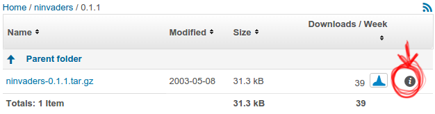

# Lab 03

Objetivos:
  - Criar um novo pacote para o nInvaders
  - Compreender como adicionar dependências
  - Adicionar patches para dar suporte ao Nunchuk ao nInvaders

## Preparação

Após realizar uma pesquisa no Google, encontre o site do *nInvaders* e baixe seu código-fonte. Analise o sistema de compilação e conclua qual infraestrutura de pacote Buildroot é mais adequada para criar um pacote para o *nInvaders*.

## Pacote mínimo

Crie um diretório para o pacote nas fontes do Buildroot, `package/ninvaders`. Crie um arquivo `Config.in` com uma opção para habilitar este pacote, e um arquivo `ninvaders.mk` mínimo que especifique o necessário apenas para baixar o pacote.

Para referência, a URL de download do pacote nInvaders é https://sourceforge.net/projects/ninvaders/files/ninvaders/0.1.1/.

Nota: para isso, apenas duas variáveis precisam ser definidas no arquivo .mk, mais a chamada à macro de infraestrutura de pacote apropriada.

Agora, vá para `menuconfig`, habilite o *nInvaders* e execute `make`. Você deve ver o pacote nInvaders sendo baixado e extraído. Olhe em output/build/ para ver se foi extraído corretamente como esperado.

## Faça ele compilar!

Como você viu nos passos anteriores, o *nInvaders* usa um `Makefile` simples para seu processo de compilação.

Então, você terá que definir a variável de *comandos de compilação* para acionar a compilação do *nInvaders*. Para fazer isso, você terá que usar quatro variáveis fornecidas pelo Buildroot:

- `TARGET_MAKE_ENV`, que deve ser passado no ambiente ao chamar `make`.
  
- `MAKE`, que contém o nome apropriado da ferramenta **make** com potencialmente alguns parâmetros adicionais para paralelizar a compilação.

- `TARGET_CONFIGURE_OPTS`, que contém a definição de muitas variáveis frequentemente usadas por Makefiles: CC, CFLAGS, LDFLAGS, etc.

- `@D`, que contém o caminho para o diretório onde o código-fonte do *nInvaders* foi extraído.
  
Ao criar pacotes Buildroot, muitas vezes é uma boa ideia olhar como outros pacotes estão fazendo as coisas. Procure, por exemplo, o pacote jhead, que será bastante semelhante ao nosso pacote `ninvaders`.

Depois de escrever a etapa de compilação do *nInvaders*, é hora de testá-lo. No entanto, se você simplesmente executar o make para iniciar a compilação do Buildroot, o pacote ninvaders não será reconstruído, porque já foi construído.

Então, vamos forçar o Buildroot a reconstruir o pacote removendo completamente seu diretório de origem:

```
make ninvaders-dirclean
```

E então iniciando a compilação:

```
make
```

Desta vez, você deve ver o passo "ninvaders 0.1.1 Building" realmente fazendo algo, mas falhando rapidamente com uma mensagem dizendo que o arquivo `ncurses.h` não pôde ser encontrado.

Siga para a próxima seção para ver como resolver este problema!

## Lidando com dependências

O arquivo de cabeçalho ncurses.h está faltando porque o *nInvaders* depende da biblioteca ncurses para desenhar sua interface em um terminal baseado em texto. Então, precisamos adicionar o ncurses nas dependências do nInvaders. Para isso, você precisa fazer duas coisas:

- Expressar a dependência no arquivo Config.in do pacote. Use uma declaração "select" para garantir que a opção do pacote ncurses seja automaticamente selecionada quando o ninvaders é habilitado. 

  > Verifique se o pacote ncurses não possui suas próprias dependências que precisam ser propagadas para o pacote ninvaders.

- Expressar a dependência no arquivo .mk do pacote.

Reinicie a construção do pacote novamente usando make ninvaders-dirclean all (o que é o mesmo que fazer make ninvaders-dirclean seguido de make).

Agora a compilação do pacote falha na hora da linkagem com mensagens como `multiple definition of 'skill_level'; aliens.o:(.bss+0x674): first defined here.`

## Customizando CFLAGS

O problema de **múltiplas definições** ocorre porque o código-fonte do nInvaders é bastante antigo e tem várias unidades de compilação redefinindo os mesmos símbolos. Embora isso tenha sido aceito por versões antigas do GCC, desde o GCC 10 isso não é mais aceito por padrão.

Embora pudéssemos corrigir a base de código do nInvaders, iremos por um caminho diferente: pedir ao GCC para se comportar como fazia antes do GCC 10 e aceitar essas redefinições. Isso pode ser feito passando a flag -fcommon do GCC.

Para fazer isso, verifique se CFLAGS está definido como $(TARGET_CFLAGS) -fcommon em NINVADERS_BUILD_CMDS.

Reinicie a compilação com `make ninvaders-dirclean all`.

Agora o pacote deve ser compilado corretamente! Se você procurar em output/build/ninvaders-0.1.1/, você deve ver um arquivo binário nInvaders. Execute o programa `file` com o nInvaders como argumento para verificar se ele foi realmente construído para ARM.

No entanto, embora o nInvaders tenha sido compilado com sucesso, ele não está instalado em nosso sistema de arquivos raiz de destino!

## Instalando e testando o programa

Se você estudar o Makefile do nInvaders, verá que não há disposição para instalar o programa: não há a regra `install:`.

Então, no arquivo ninvaders.mk, você terá que criar os comandos de instalação alvo e simplesmente instalar manualmente o binário nInvaders. Use a variável $(INSTALL) para isso. Novamente, tome como exemplo o pacote jhead para saber como realizar essa tarefa.

Reconstrua novamente o pacote ninvaders. Desta vez, você deverá ver o binário nInvaders em output/target/usr/bin/!

Atualize o seu sistema de arquivos raiz no cartão SD e reinicie o sistema. nInvaders não funcionará muito bem pela porta serial, então faça o login no seu sistema por meio do ssh e jogue nInvaders com o teclado!

> Nota: se você receber o erro "Error opening terminal: xterm-256color." ao executar nInvaders, emita primeiro o comando `export TERM=xterm`

## Suporte ao Nunchuk

Jogar com o teclado é legal, mas jogar com nosso Nunchuk seria ainda melhor! Escrevemos um patch para nInvaders que torna isso possível.

Este patch está disponível no diretório deste laboratório, sob o nome [/labs/lab03/files/0001-joystick-support.patch](./files/0001-joystick-support.patch).

Copie este patch para o local correto para que seja aplicado após o nInvaders ser extraído pelo Buildroot e antes de ser construído. Reconstrua novamente o pacote ninvaders. Verifique se o patch é aplicado na etapa `ninvaders 0.1.1 Patching`.

No entanto, esse patch depende da interface do joystick do kernel Linux, que precisamos habilitar. Vá para a configuração do kernel Linux usando make linux-menuconfig e habilite CONFIG_INPUT_JOYDEV. Saia e certifique-se de salvar sua configuração de kernel com segurança usando `make linux-update-defconfig`. Reinicie a compilação geral executando make.

Em seguida, atualize a sua imagem de kernel e o sistema de arquivos raiz no cartão SD, reinicie e inicie nInvaders em uma sessão SSH. Agora você deve ser capaz de controlá-lo usando o joystick do Nunchuk e disparar com o botão C.

## Adicionando um arquivo de hash

Para finalizar o pacote, adicione o arquivo de hash ausente, para que as pessoas que estão construindo esse pacote possam ter certeza de que estão construindo o mesmo código-fonte. Para obter o hash, o SourceForge fornece essa informação: vá para a página de download do nInvaders e ao lado do nome do arquivo, há um pequeno ícone de informação que fornecerá os hashes MD5 e SHA1. Adicione ambos os hashes ao arquivo de hash.

<p align="center">

Depois que o arquivo de hash for adicionado, reconstrua completamente o pacote fazendo:

```
make ninvaders-dirclean all
```
Olhe a saída da construção e antes do passo **0.1.1 Extracting** do ninvaders, você deve ver uma mensagem como esta:

```
ninvaders-0.1.1.tar.gz: OK (sha1: ....)
ninvaders-0.1.1.tar.gz: OK (md5: ....)
```

## Testando a remoção do pacote

Agora, para experimentar com o Buildroot, faça o seguinte teste: desative o pacote ninvaders no menuconfig e reinicie a construção fazendo make. Depois que a construção estiver concluída (o que deve ser muito rápido), verifique em `output/target/`. O nInvaders ainda está instalado? Se sim, por quê?

## Verificando a sanidade do seu pacote

Se você quiser verificar se seu pacote atende às regras de estilo de codificação do Buildroot, execute:

```
make check-package
```

Embora um resultado bem-sucedido não signifique que seu pacote seja perfeito, pelo menos verifica alguns requisitos básicos.

<!-- Markdown Reference

## header 1

### header 2

* italic *

**bold**

*** bold & italic ***

~~ strike-through ~~

> quote

` monospace-code `

```
code block
```
named footnote[^footnote01]
[^footnote01]: See https://elinux.org/images/e/ef/USB_Gadget_Configfs_API_0.pdf for more details

Repo link to file
[/labs/lab02/files/S30usbgadget](./files/S30usbgadget).

Image centered and scaled.
<p align="center">

-->
